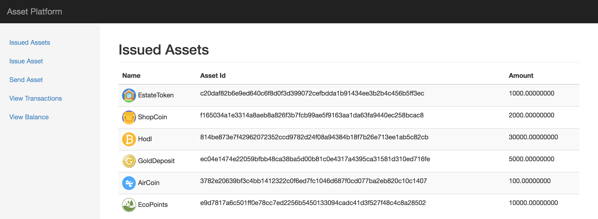
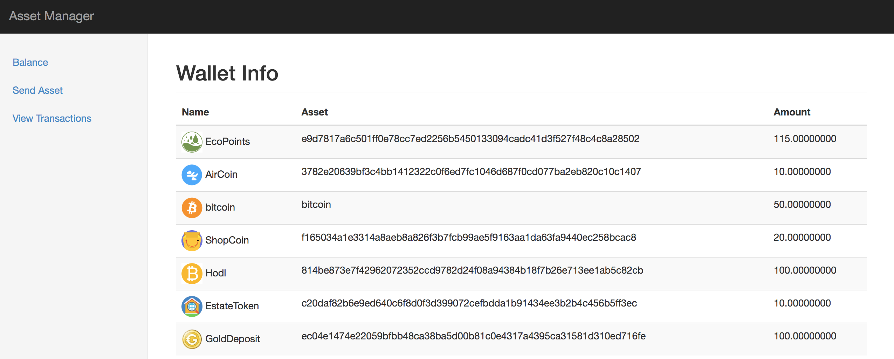

# Liquid Asset Platform (LAP)

**Liquid Asset Platform** enables issuers to create and manage custom tokenized assets on the Rootstock blockchain. These assets can represent various items such as loyalty points, tokenized fiat, cryptocurrencies, digital collectibles, or tangible assets like gold and property.

## Key Features

1. **Asset Platform:**
   - Manage the entire lifecycle of issued assets.
   - Features include issuing, sending, viewing issued assets, transactions, and balances.

2. **Asset Manager:**
   - Manage asset holdings.
   - Features include buying, trading assets, viewing balances, and transactions.

## Why Choose Liquid Asset Platform?

- **Rootstock Integration:** Utilizes Rootstock's EVM compatibility for seamless dApp development on Bitcoin.
- **Confidential Transactions:** Ensures privacy with Confidential Assets, where only transaction participants can view asset details.
- **Fast Finality:** Achieves transaction finality in approximately 2 minutes.
- **Comprehensive Management:** A unified platform for managing all asset lifecycle aspects.

## Screenshots

### Asset Platform (Issued Assets)


### Asset Manager (Wallet Balance)


## Getting Started

1. **Clone Repository:**
   ```bash
   git clone https://github.com/viraja1/liquid_asset_platform.git
   ```

2. **Navigate to Directory:**
   ```bash
   cd liquid_asset_platform
   ```

3. **Install Docker and Docker Compose:**
   - Docker: [Installation Guide](https://docs.docker.com/install/#server)
   - Docker Compose: [Installation Guide](https://docs.docker.com/compose/install/)

4. **Build Docker Images:**
   ```bash
   docker-compose -f docker-compose.yml build
   ```

5. **Start Docker Containers:**
   ```bash
   docker-compose -f docker-compose.yml up -d
   ```

6. **Access Issuer App:**
   - [Asset Platform](http://localhost:5000)

7. **Access Buyer App:**
   - [Asset Manager](http://localhost:5001)

8. **Distribute Initial Free Coins:**
   - Use `initialfreecoins` in `docker-compose.yml` to distribute initial funds.
   - Send coins from Issuer App to Buyer App and verify balances.

9. **Issue Asset:**
   - Issue new assets via [Issue Assets](http://localhost:5000/issue_asset/).

10. **Purchase Assets:**
    - Buyer sends Bitcoin to Issuer and receives assets.

11. **Verify Transactions:**
    - Check transactions in both Issuer ([Transactions](http://localhost:5000/transactions/)) and Buyer ([Transactions](http://localhost:5001/transactions/)) apps.

12. **Use Assets:**
    - Buyers can use assets for transactions with the Issuer.

